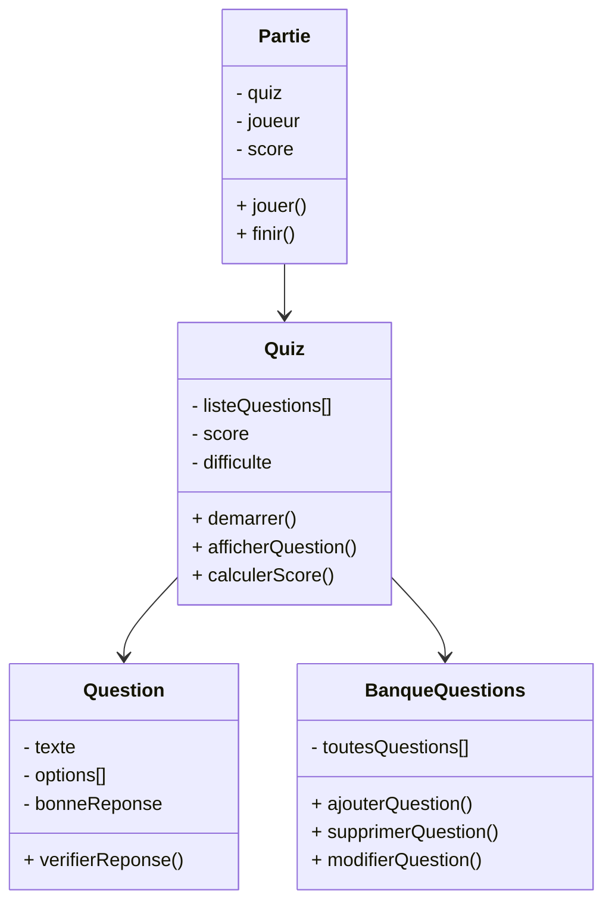
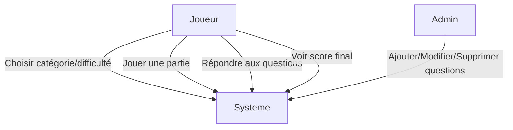
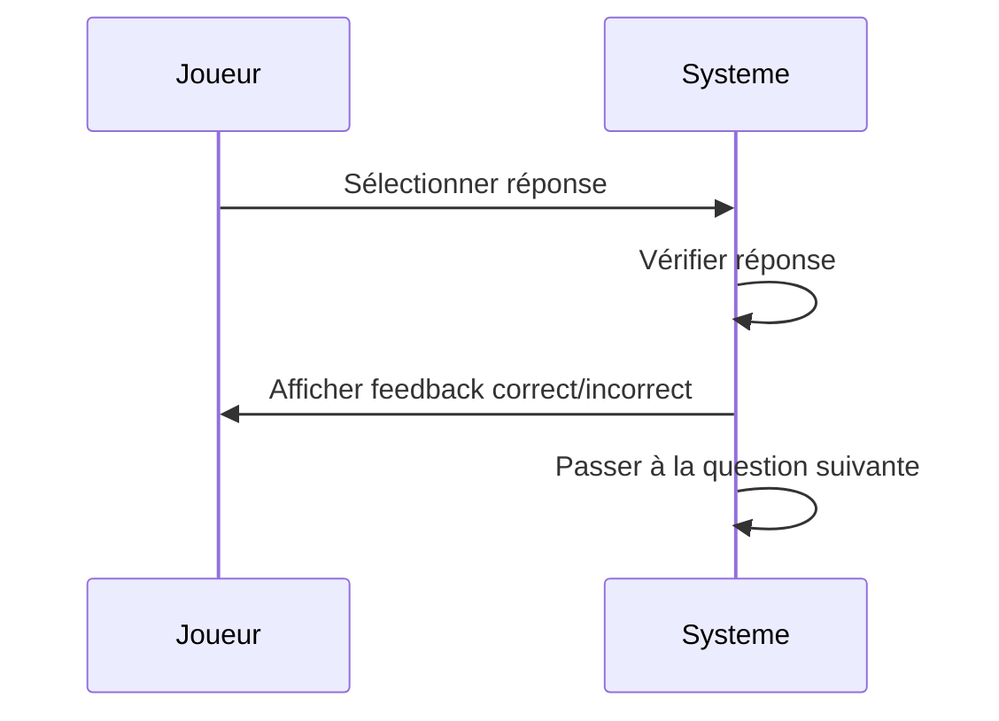
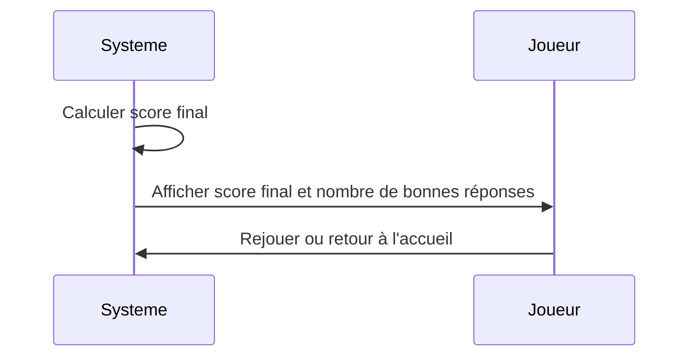

``````mermaid
flowchart TD
    A[Début du Quiz] --> B{Sélectionner la difficulté}
    B -->|Facile| C[Charger questions faciles]
    B -->|Moyen| D[Charger questions moyennes]
    B -->|Difficile| E[Charger questions difficiles]
    C --> F[Afficher question 1]
    D --> F
    E --> F
    F --> G{Réponse correcte?}
    G -->|Oui| H[Incrémenter score]
    G -->|Non| I[Afficher bonne réponse]
    H --> J{Plus de questions?}
    I --> J
    J -->|Oui| F
    J -->|Non| K[Afficher score final]
    K --> L[Fin du Quiz]
```